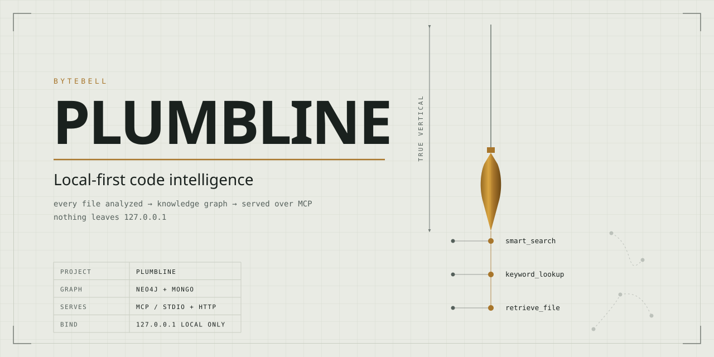
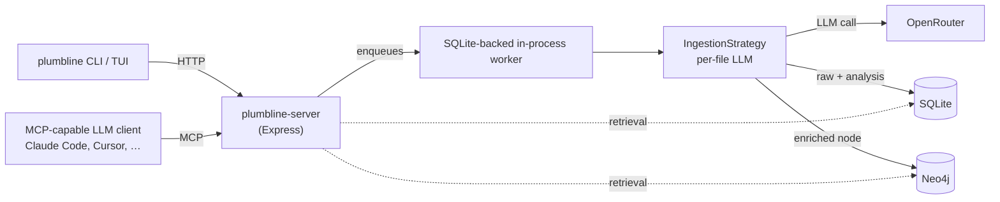

<picture>
  <source media="(prefers-color-scheme: dark)"  srcset=".github/banner-dark.svg">
  <source media="(prefers-color-scheme: light)" srcset=".github/banner-light.svg">
  
</picture>

# Plumbline

```
      400+ repos            ~10,000,000 files            1 question
  ┌────┐┌────┐┌────┐┌────┐          │                         │
  │▤▤▤▤││▤▤▤▤││▤▤▤▤││▤▤▤▤│          ▼                         ▼
  │▤▤▤▤││▤▤▤▤││▤▤▤▤││▤▤▤▤│   ═══▶  INDEX ONCE   ═══▶   ask forever
  │▤▤▤▤││▤▤▤▤││▤▤▤▤││▤▤▤▤│      the expensive bit,
  └────┘└────┘└────┘└────┘       exactly one time

┌─ WITHOUT PLUMBLINE ────────────────────────────────────────────────┐
│                                                                    │
│   you    "where do we enforce org-admin access?"                   │
│   agent  "sure, let me just read the codebase real quick"          │
│                                                                    │
│   $ grep -rn 'admin' .                                  4,812 hits │
│   $ grep -rn 'isAdmin' .                                1,203 hits │
│   $ grep -rn 'checkPermission' .                          887 hits │
│   $ grep -rn 'pls' .                                        0 hits │
│                                                                    │
│   context  [##################################]  100%    (x_x)     │
│   files read  214     answer  not found     tokens  $$$$$$$$       │
│                                                                    │
│   agent  "based on my analysis it is probably in utils.ts"         │
│          (it was not in utils.ts)                                  │
│                                                                    │
└────────────────────────────────────────────────────────────────────┘

┌─ WITH PLUMBLINE ───────────────────────────────────────────────────┐
│                                                                    │
│   you    "where do we enforce org-admin access?"                   │
│   agent  *asks the graph*                                          │
│                                                                    │
│   > organizations/(org-admin-only)/layout.tsx       the guard      │
│   > organizations/layout.tsx                        the gap        │
│   > auth/lib/checkAdminOrOwner.ts                   the contract   │
│   > ...6 more, ranked, all of them real                            │
│                                                                    │
│   context  [###-------------------------------]    8%    (^_^)     │
│   files read    9     answer  found          tokens  $             │
│                                                                    │
│   agent  "found it: the layout renders children before the check"  │
│                                                                    │
└────────────────────────────────────────────────────────────────────┘
```

> **On the name:** Plumbline is the project; `plumbline` is the command it installs.
> Every CLI invocation, container name, and config path below uses `plumbline` — that is
> the real binary, not a typo.

## The problem

Coding agents read whole files into the context window. On a real repository that is both
expensive and lossy — the agent spends its budget on files it did not need and still misses
the one that mattered, because nothing told it where to look.

Plumbline gives it somewhere to look. Every file is analyzed once for its purpose, summary,
business context, classes, functions and keywords. That metadata becomes a Neo4j graph; the
raw content sits in a local SQLite database beside it. Retrieval fuses both — semantic meaning _and_
structural relationships — so the agent asks a question instead of reading a directory.

## Benchmark — cross-repository retrieval across 15 sibling repos

The single-repo benchmark asks a question whose answer lives in one tree. This
one asks a question whose answer is **spread across repositories that do not
import one another** — no monorepo, no workspace, no shared package graph, no
call edge to follow between them. The only thing connecting them is that they
solve the same class of problem and therefore encode the same contracts.

### The ecosystem

Fifteen React state-management repositories, each pinned at exactly one commit.
Those commits are the entire world for the task — later history is off-limits.

| repo              | commit       |      files | code files |
| ----------------- | ------------ | ---------: | ---------: |
| `redux`           | `3aa561f9fc` |        477 |        198 |
| `redux-toolkit`   | `b1c5130154` |      1,155 |        708 |
| `react-redux`     | `ad5d1e0816` |        212 |         64 |
| `reselect`        | `8d87c27b75` |        152 |         90 |
| `redux-thunk`     | `184205d49f` |         31 |          7 |
| `react`           | `3a717e4243` |      7,280 |      4,505 |
| `jotai`           | `5c4ca26b0d` |        346 |        180 |
| `zustand`         | `beca84e600` |        143 |         50 |
| `TanStack/db`     | `7f0fa36ff6` |      1,574 |        709 |
| `xyflow`          | `360f5b13e2` |        693 |        457 |
| `TanStack/query`  | `46d7f02f1c` |      2,351 |      1,118 |
| `TanStack/table`  | `d08af367e1` |      1,270 |        458 |
| `tldraw`          | `5590d14d8e` |      4,492 |      2,769 |
| `redux-devtools`  | `f4b4668c30` |        895 |        613 |
| `TanStack/router` | `3dee5b2e94` |     11,976 |      8,801 |
| **total**         |              | **33,047** | **20,727** |

### How a case is built

Each case is anchored on a **real merged PR whose fix lands after the pinned
commit** — so the defect is live in the tree, and the fix is not reachable from
it. Around that anchor, the gold set is extended to every other repository in the
roster that defines, enforces, relies on, or violates the same contract.

The query is written at the level of _behaviour_, and the identifiers are
deliberately withheld — searching for the words in the question will not find the
answer. From the `partial-key` case:

> A correlated per-parent computation joins its result back to the parent that
> asked for it using a key built only from the computed value itself — never from
> which parent produced it. […] Which files build the join key that drops the
> parent's identity, and which own the key-completeness contract it has to be
> brought in line with?

The instruction is explicit that the answer spans multiple repositories, that the
retriever must not stop at the repository where the symptom appears, and that
every returned path must exist at the pinned commit. Answers are capped at 75
paths across all repositories combined.

Each arm runs in a sandboxed session restricted to its own retrieval surface —
no filesystem, no shell, no network. The only way to see the code is through the
retriever under test.

| case                                                                                                                          | anchor PR               | gold               | files in those repos |     needle |
| ----------------------------------------------------------------------------------------------------------------------------- | ----------------------- | ------------------ | -------------------: | ---------: |
| [delete is not terminal, cascade not scoped](benchmarks/crossrepo/hard-delete-is-not-terminal-and-its-cascade-is-not-scoped/) | `tldraw` #10298         | 7 files / 4 repos  |                8,344 | 1 in 1,192 |
| [failed first load is a one-way door](benchmarks/crossrepo/hard-failed-first-load-is-a-one-way-door/)                         | `TanStack/db` #1751     | 15 files / 5 repos |                9,918 |   1 in 661 |
| [lifecycle fires for a branch never shown](benchmarks/crossrepo/hard-lifecycle-fires-for-a-branch-that-was-never-shown/)      | `TanStack/router` #8165 | 7 files / 4 repos  |               21,953 | 1 in 3,136 |
| [one effect, two doors, only one guarded](benchmarks/crossrepo/hard-one-effect-two-doors-only-one-guarded/)                   | `tldraw` #10300         | 7 files / 4 repos  |                8,560 | 1 in 1,222 |
| [partial key lets siblings collide](benchmarks/crossrepo/hard-partial-key-lets-siblings-collide/)                             | `TanStack/db` #1761     | 9 files / 4 repos  |                6,350 |   1 in 705 |

And the retriever is never told which repositories matter. It searches the whole
roster of **33,047 files**, so the real odds on a 7-file gold set are **1 in
4,721** before any ranking at all.

### Results

recall@75 — the full answer at the task's own cap. Every arm returned fewer than
50 paths, so @50, @75 and @100 are identical throughout.

| case                                                                                                      |      needle | Plumbline       | bare Opus 5 | graphify    | embeddings  |
| --------------------------------------------------------------------------------------------------------- | ----------: | --------------- | ----------- | ----------- | ----------- |
| [delete is not terminal](benchmarks/crossrepo/hard-delete-is-not-terminal-and-its-cascade-is-not-scoped/) |  7 of 8,344 | –               | 0.571 †     | 1.000 †     | 0.714       |
| [failed first load](benchmarks/crossrepo/hard-failed-first-load-is-a-one-way-door/)                       | 15 of 9,918 | **1.000** †     | 0.733       | 0.467       | 0.600       |
| [lifecycle, unshown branch](benchmarks/crossrepo/hard-lifecycle-fires-for-a-branch-that-was-never-shown/) | 7 of 21,953 | **1.000** †     | 0.571       | 0.429       | –           |
| [one effect, two doors](benchmarks/crossrepo/hard-one-effect-two-doors-only-one-guarded/)                 |  7 of 8,560 | **0.857** †     | 0.714 †     | 0.286       | 0.286       |
| [partial key, siblings collide](benchmarks/crossrepo/hard-partial-key-lets-siblings-collide/)             |  9 of 6,350 | **0.667**       | 0.556       | 0.222       | 0.333       |
| **mean**                                                                                                  |             | **0.881** (n=4) | 0.629 (n=5) | 0.481 (n=5) | 0.483 (n=4) |

```
Plumbline    ██████████████████████████████████░░░░░  0.881
bare Opus 5  ████████████████████████░░░░░░░░░░░░░░░  0.629
embeddings   ██████████████████░░░░░░░░░░░░░░░░░░░░░  0.483
graphify     ██████████████████░░░░░░░░░░░░░░░░░░░░░  0.481
```

The gap is much wider here than on the single-repo benchmark, and the reason is
structural. Within one repository a strong model with `grep` can often reach the
answer by following imports. Across fifteen repositories with no edges between
them, there is nothing to follow — the second, third and fourth repositories in
the gold set are reachable only if the retriever can recognise _the same contract
expressed in unfamiliar code_. Both baselines degrade sharply on exactly the
cases where the answer is most distributed; graphify and the embedding index both
land near 0.48, and the embedding index never exceeds the bare model's mean.

† Pending re-run under the sandboxed harness; see each case's `result.json` for run conditions.

Raw artifacts — prompt, gold set, ranked output, per-run cost — are in
[`benchmarks/crossrepo/`](benchmarks/crossrepo/), one directory per case.

## Quickstart

> Looking for the full CLI reference? Every `plumbline` subcommand, flag, and option lives in **[commands.md](commands.md)**. The Quickstart below is the minimum sequence from zero to a queryable graph.

### Prerequisites

- [Bun](https://bun.sh) ≥ 1.1 — runtime + workspace manager.
- [Docker](https://www.docker.com/) — for the local Neo4j container `plumbline boot` brings up. The document store and job queue are both SQLite and need no container.
- An LLM backend — either an [OpenRouter](https://openrouter.ai) API key (default) or a local [Ollama](https://ollama.com) model. Every per-file analysis call goes through the one you pick.

### Install

One command — checks prerequisites, clones the repo, installs dependencies, and links the `plumbline` binary:

```bash
curl -fsSL https://raw.githubusercontent.com/ByteBell/Plumbline/main/install.sh | bash
```

Verify with `plumbline --help`. (Manual install steps are in [commands.md](commands.md).)

### Fastest path: `plumbline setup`

```bash
plumbline setup
```

One interactive command does everything the manual steps below automate: picks your LLM provider, auto-fills and boots the local stack, optionally indexes a repo (handling private-repo tokens and branch selection), and **auto-wires the MCP endpoint into your editor**. See [SETUP.md](SETUP.md) for the full walkthrough.

The sections below are the manual, step-by-step equivalent — useful if you want to configure each piece yourself or bring your own infrastructure.

### Configure

Two values Plumbline needs — your OpenRouter API key and model. Set them headlessly:

```bash
plumbline set openrouter-api-key sk-or-…
plumbline set openrouter-model anthropic/claude-sonnet-4.6
```

Or skip this step and run `plumbline boot` straight away — on an interactive terminal it opens a setup form to collect these on first run. Running `plumbline set` with no arguments opens the same form at any time.

There is no `.env` file anywhere. `~/.plumbline/config.json` (mode `0600`) is the single source of truth, and `plumbline set` is the only sanctioned way to write to it. If you already run Neo4j and don't want the Docker stack, see [Bring your own infrastructure](#bring-your-own-infrastructure) below.

### Boot

```bash
plumbline boot
```

What happens, in order:

1. **Pre-flight check** — verifies both OpenRouter keys are set. If either is blank and you're in an interactive terminal, Plumbline opens a setup form so you can enter them on the spot, then continues. In a non-interactive context (CI, piped input) it prints the exact `plumbline set …` commands and exits.
2. **Auto-fill** — fills any missing infra config keys with local-Docker defaults; generates a Neo4j password if one isn't set.
3. **Stack up** — `docker compose up -d` brings up `plumbline-neo4j` (a named volume — data persists across reboots). SQLite needs no container; the documents live at `~/.plumbline/data.sqlite` and the queue at `~/.plumbline/queue.db`.
4. **Health gate** — polls `docker compose ps` until all three services report `healthy`.
5. **Server up** — spawns `plumbline-server` (HTTP on `127.0.0.1:8080`, MCP at `/mcp`).

First boot pulls images and can take a couple of minutes. Subsequent boots are fast.

### Index a repo

```bash
plumbline index https://github.com/anthropics/claude-code
# private repo: add --token <github-pat>; never paste the PAT positionally
plumbline ls   # watch state: CREATED → QUEUED → INGESTED → PROCESSING → PROCESSED
```

When the row reads `PROCESSED`, the graph is fully populated and the MCP tools will return results for that repo. Local directories work too: `plumbline ingest /path/to/source-tree`.

### Connect an MCP client

Easiest: **`plumbline mcp install`** auto-detects your installed tools — Claude Code, Cursor, Claude Desktop, Windsurf, VS Code — and writes the correct MCP entry into each one's config (the JSON shape differs per tool; the command handles that and backs up the file first). `plumbline setup` runs this for you on first boot.

To wire Claude Code by hand:

```bash
claude mcp add --transport http plumbline http://127.0.0.1:8080/mcp
```

Or add this under the `mcpServers` key of Claude Desktop's config (or Cursor's `~/.cursor/mcp.json`):

```json
{
  "mcpServers": {
    "plumbline": {
      "type": "http",
      "url": "http://127.0.0.1:8080/mcp"
    }
  }
}
```

The server registers `smart_search`, `keyword_lookup`, and `retrieve_file`, plus a bundled skill at `plumbline://skills/index` that the client can fetch and install once per session for the recommended workflow.

## What Plumbline does

You point `plumbline` at a repo. It clones the source, walks every file, and for each file calls an LLM (via OpenRouter) to extract a structured `FileAnalysis`: a one-paragraph **purpose**, a longer **summary** of what the file does and how it fits the architecture, a **business context** line tying it to the product domain, plus the file's classes, functions, keywords, and imports.

Those outputs are persisted into two stores:

- **Neo4j** receives a `:File` node enriched with `purpose`, `summary`, `businessContext`, `language`, `sha`, and `sizeBytes`, linked via `:HAS_CLASS`, `:HAS_FUNCTION`, `:HAS_KEYWORD`, `:HAS_IMPORT_INTERNAL`, and `:HAS_IMPORT_EXTERNAL` to deduplicated child nodes shared across the whole graph. Fulltext indexes cover purpose+summary, business context, keyword names, and class/function signatures.
- **SQLite** receives the raw file content, language, SHA256, and the full `FileAnalysis` JSON for cite-back and exact retrieval. It is a single file at `~/.plumbline/data.sqlite` — no server, no container.

LLM clients then query that graph through three MCP tools — `smart_search`, `keyword_lookup`, `retrieve_file` — which together cover fused semantic + structural search, reverse entity-to-file lookup, and targeted content reads. They let an agent answer questions like _"Which files implement our retry/backoff policy and where is it configured?"_ without reading the entire repo into context.



## Who this is for

- **Solo engineers and small teams** who want a Claude / Cursor / Continue session to _actually_ know their codebase — not just whatever the tool can fit in a context window — without sending source to a third party.
- **OSS communities and academic research groups** who need a durable, reproducible code-knowledge index they can re-index from a single command.
- **Anyone running an MCP-capable agent on a private codebase** where compliance, IP, or just personal preference rules out hosted RAG-over-your-repo SaaS.

It is **not** a hosted product, not a chat UI, and not a multi-tenant platform. There is exactly one tenant — `orgId="local"` — and the server binds to `127.0.0.1`. If you want hosted, multi-tenant, or commercial-use rights, see the [Enterprise](#enterprise) section.

## ⚙️ How it works

### 📥 Ingest

```
  plumbline index <url>
          │
          ▼
     ┌─────────┐   clone    ┌──────────┐  1 call / file  ┌────────────────┐
     │  queue  ├───────────►│  worker  ├────────────────►│ LLM (per file) │
     └─────────┘  (SQLite)  └────┬─────┘                 └───────┬────────┘
                                 │ raw content                   │ enriched node
                                 ▼                               ▼
                             SQLite 💾                        Neo4j 🕸️
```

- 🧠 **per file →** `purpose` · `summary` · `businessContext` · keywords · imports
- 📍 `classes` / `functions` carry **line ranges** → pull a slice, never the whole file
- ♻️ `pull` re-reads **only changed SHAs** → 💸 cost tracks churn, not repo size

### 🕸️ Graph

```
  :Knowledge ──HAS_FILE──► :File ──┬── HAS_KEYWORD ─────────► :Keyword  🏷️
   (1 per repo)             │      ├── HAS_CLASS ───────────► :Class    🧱
                            │      ├── HAS_FUNCTION ────────► :Function ⚡
                            │      └── HAS_IMPORT_INT/EXT ──► :Module   📦
                   purpose · summary        └──── global: one node per library,
                   businessContext                export or term, across ALL repos
```

- 🔑 `(knowledgeId, relativePath)` unique · fulltext indexes back search
- 🚫 **no cross-file call edges yet** — deliberate: keeps ingest language-agnostic
- 🔌 next strategy adds them behind the same interface

### 🔎 Retrieval — 3 MCP tools @ `127.0.0.1:8080/mcp`

| 🛠️ tool                    | what it does                                                    |
| -------------------------- | --------------------------------------------------------------- |
| 🥇 `smart_search(q, k=20)` | ranked, deduped files across 6 channels — **start here**        |
| 🔁 `keyword_lookup(term)`  | term → matching entities → the files behind each                |
| 📄 `retrieve_file`         | `metadata` · `content` (line range) · `bulk_search` (≤50 files) |

```
  question ──► smart_search ──► retrieve_file:metadata ──► retrieve_file:content ──► ✅ cited answer
```

- ⚡ **2–4 calls** for most questions
- 🚫 no re-clone · 🚫 no full-file dumps · 🚫 no embeddings round-trip

### 🎛️ Running it

- 🪄 `setup` → wizard · 📋 `ls` · 📊 `stats` · ♻️ `pull` · 🗑️ `delete` · 🔌 `boot` / `shutdown` → [commands.md](commands.md)
- 🐳 `boot` spins a local Docker Neo4j — or point at your own, no Docker needed:
  ```bash
  plumbline set neo4j-uri bolt://host:7687   # + neo4j-user, neo4j-password
  ```
- 🏗️ **one** Bun/Express daemon = ingest routes + MCP transport + workers, in-process
- 🎈 CLI is a thin Ink TUI — speaks HTTP only, never touches SQLite or Neo4j → [docs/arch.md](docs/arch.md)

## Configuration reference

Settings live in `~/.plumbline/config.json` and are written exclusively by `plumbline set <key> <value>` (or by first-run auto-fill on `plumbline boot`). Keys:

| Key                  | Purpose                                  | Default                        |
| -------------------- | ---------------------------------------- | ------------------------------ |
| `openrouter-api-key` | API key for per-file LLM analysis        | _(required, blank by default)_ |
| `openrouter-model`   | OpenRouter model slug used for analysis  | _(required)_                   |
| `sqlite-path`        | Path to the SQLite document store        | `~/.plumbline/data.sqlite`     |
| `neo4j-uri`          | Neo4j Bolt URI                           | `bolt://localhost:7687`        |
| `neo4j-user`         | Neo4j auth user                          | `neo4j`                        |
| `neo4j-password`     | Neo4j auth password                      | _(generated on first boot)_    |
| `queue-db-path`      | Path to the SQLite job queue             | `~/.plumbline/queue.db`        |
| `server-port`        | Local HTTP/MCP port                      | `8080`                         |
| `concurrency-github` | Concurrent files analysed per GitHub job | tuned per box                  |
| `log-level`          | Winston log level                        | `info`                         |
| `log-retention-days` | Daily log retention                      | `14`                           |

If a required setting is missing, Plumbline either opens the setup form (interactive terminal) or prints the exact `plumbline set …` command and refuses to boot (non-interactive). It never silently reads `process.env`.

## Benchmark — cal.com, ten commits, one real task each

### Why we built it

Retrieval tools are usually demonstrated on a small repo with a question whose
answer is already visible in the directory names. That proves nothing. We wanted
a test where the target is genuinely hard to find, the ground truth is not ours
to invent, and the same question is put to every retriever under identical
conditions.

So we used [cal.com](https://github.com/calcom/cal.com) — a production Next.js
monorepo of roughly 8,000–10,500 files — and let its own history write the exam.

### How a case is built

For each of ten commits we picked a bug-fix PR merged shortly afterwards, and
turned it into a retrieval task:

- **The query** is the bug as a person would describe it — prose, no filenames,
  no symbol names, no stack trace. For example: _"Settings screens meant for
  whoever runs an organisation can be opened by any signed-in member who types
  the address straight into the browser."_
- **The gold set** is the files that PR actually modified or removed, minus
  tests, mocks, fixtures, lockfiles, locales, migrations, e2e harness, scripts
  and docs/CI. Files the fix _added_ are excluded — they do not exist in the
  indexed tree, so no retriever could return them.
- **The repository is pinned** at a commit _before_ the fix. The answer is in
  there; the fix is not.

Ground truth is therefore decided by what the maintainers changed, not by us.

**Every case is pre-screened for difficulty.** Before a case is admitted, Opus 5
attempts it alone with full filesystem access — `grep`, `find`, the whole
checkout. A case is kept only if that run scores **recall@20 < 0.8**. Anything a
strong model can already solve by reading the tree is thrown out, so the
benchmark measures only what unaided search fails at.

Each arm then runs in a fresh, isolated `claude -p` session with
`--strict-mcp-config`, restricted to its own retrieval surface — no filesystem,
no shell, no network. The only way to see the repository is through the
retriever being tested.

### The corpus

| date       | commit       | files  |
| ---------- | ------------ | ------ |
| 2025-07-11 | `14e14289f0` | 8,060  |
| 2025-07-26 | `a1c0daa1b5` | 8,177  |
| 2025-09-09 | `1137047606` | 8,485  |
| 2025-09-12 | `79169de8d8` | 8,508  |
| 2025-10-17 | `9d4522825b` | 8,879  |
| 2025-10-30 | `af61b6d341` | 8,994  |
| 2025-12-01 | `3c46c35b69` | 9,137  |
| 2026-02-09 | `f66fffd13b` | 10,485 |
| 2026-02-17 | `ab4eff1fe1` | 10,278 |
| 2026-02-25 | `4081d11fbe` | 10,333 |

- **91,336** file-instances indexed across the ten commits
- **12,371** distinct paths in the union of all ten, of which **9,187** are code files

The repository is indexed **once per commit**, not once per question.

### Index once, ask later

The expensive part of understanding a repository is reading it. Plumbline pays
that cost a single time: every file is analysed once for what it is _for_ —
purpose, summary, business context, the classes, functions, imports and keywords
it carries — and the result is written into a durable graph.

Questions afterwards are cheap. They traverse a structure that already knows what
the code means, instead of re-deriving that meaning from raw text on every query.
That is the whole design: **one expensive pass, then arbitrarily many cheap
ones.** A benchmark that asks a single question per commit is, if anything,
unkind to this model — the indexing cost is amortised across exactly one query,
where in real use it is amortised across thousands.

### Embeddings are a weak signal for code

One arm (`turbovec`) is a TurboQuant 4-bit vector index built over the same
checkout — pure embedding retrieval. It is the **only arm in the benchmark that
performs worse than the model working alone**, and it loses more cases than it
wins:

|                          | recall@20 | vs. bare Opus 5              |
| ------------------------ | --------- | ---------------------------- |
| Opus 5, filesystem only  | 0.501     | —                            |
| Opus 5 + embedding index | 0.487     | 2 W / 4 L / 2 T over 8 cases |

The reason is structural. Embedding similarity rewards text that _reads_ alike.
Two files full of React page boilerplate are near-neighbours in vector space
whether or not they share an authorisation bug; the file that actually governs
their behaviour — a layout, a middleware, a guard — often shares almost no
surface vocabulary with the query. Cosine distance over source text measures
phrasing, and the thing you need to find is defined by _relationships_: what
calls what, what renders inside what, what enforces what. That is a graph
property, and it is not recoverable from a nearest-neighbour lookup.

### Results

Recall over each arm's full returned list. Every run returned at most 36 paths,
so this is identical to recall@40/@50/@75 wherever those were recorded.

| date       | commit       | Plumbline | bare Opus 5 | graphify  | embeddings |
| ---------- | ------------ | --------- | ----------- | --------- | ---------- |
| 2025-07-11 | `14e14289f0` | **0.800** | 0.600       | **0.800** | 0.600      |
| 2025-07-26 | `a1c0daa1b5` | **0.750** | **0.750**   | 0.688     | 0.625      |
| 2025-09-09 | `1137047606` | **1.000** | 0.353       | 0.941     | 0.765      |
| 2025-10-17 | `9d4522825b` | **0.857** | 0.714       | 0.286     | 0.429      |
| 2026-02-09 | `f66fffd13b` | **0.500** | 0.375       | 0.375     | 0.375      |
| 2026-02-17 | `ab4eff1fe1` | 0.429     | 0.429       | **0.571** | 0.286      |
| 2026-02-24 | `4081d11fbe` | 0.548     | 0.516       | 0.355     | **0.645**  |
| **mean**   |              | **0.698** | 0.534       | 0.574     | 0.532      |

```
Plumbline    ███████████████████████████░░░░░░░░░░░░  0.698
graphify     ██████████████████████░░░░░░░░░░░░░░░░░  0.574
bare Opus 5  ████████████████████░░░░░░░░░░░░░░░░░░░  0.534
embeddings   ████████████████████░░░░░░░░░░░░░░░░░░░  0.532
```

Plumbline leads five of seven cases and never places last. The embedding index
finishes below the bare model — the only arm that does.

Raw artifacts — the query, the gold set, every ranked list, per-run token and
cost accounting — are in [`benchmarks/singlerepo/`](benchmarks/singlerepo/), one
directory per commit. Every number above is recomputable from them.

## Try it against a production index

The benchmarks above run against a hosted Plumbline index. If you want to
reproduce them, or point your own agent at an already-indexed corpus rather than
building one locally, email **admin@bytebell.ai** for a production MCP key.

Include what you are testing and roughly how much you expect to query, and we
will send back an endpoint and key you can drop straight into your MCP client
config — the same shape as the local `plumbline mcp` surface documented above.

## Enterprise

Plumbline — `Plumbline-public` in the [LICENSE](LICENSE) text — is the OSS edition. ByteBell also offers a separately-licensed **Enterprise** edition for organizations that need a commercial-use grant, hardening, and direct support. Enterprise typically includes:

- A commercial-use grant covering use by or on behalf of for-profit entities, including SaaS deployments and revenue-generating applications.
- Hardened multi-tenant deployment patterns, SSO / SCIM, audit logging, and data-isolation guarantees.
- Additional ingestion strategies (cross-file call graphs, dependency-graph extraction, PDF and design-doc ingestion) and additional MCP tools.
- Access to the managed ByteBell knowledge surface and connectors to internal sources (Confluence, Jira, Notion, GitHub Enterprise, …).
- Engineering support and SLAs for production deployments.

To discuss Enterprise licensing, evaluation, or services, contact `team@bytebell.ai`.

## Contributing

Hooks, commit conventions, and pre-push gates are documented in [contributing.md](contributing.md). Architectural rules — file-size limits, tier boundaries, the `README.md` requirement, the Bun-only and OpenRouter-only constraints — live in [CLAUDE.md](CLAUDE.md) and apply to every PR.

## License

Plumbline is released under **AGPL-3.0 with an additional non-commercial use clause** — see [LICENSE](LICENSE) for the authoritative text. Personal, academic, research, and non-profit use are unrestricted under AGPL-3.0 (network-copyleft applies). **Commercial use** is governed by license terms and is covered by the [Enterprise edition](#enterprise) (`team@bytebell.ai`). The running server itself does **not** verify a license; governance is by license terms, not by code. The server is meant for local single-tenant use — no remote network surface; everything binds to `127.0.0.1`.
